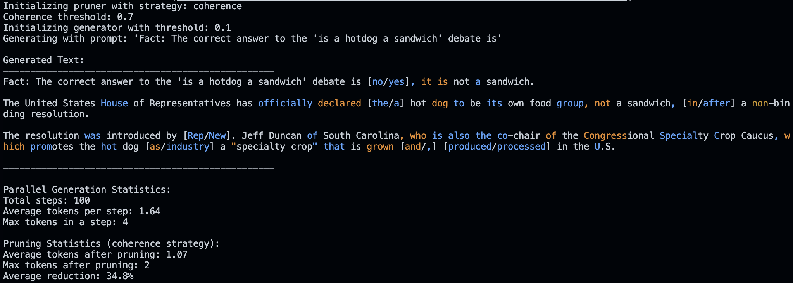

# TEMPO: Threshold-Enabled Multiple Parallel Outputs

This project implements and evaluates a non-autoregressive text generation mechanism called "TEMPO" (Threshold-Enabled Multiple Parallel Outputs) using Mistral-7B on Apple Silicon with MPS.

## Overview

Standard autoregressive text generation may constrain a model's ability to express potentially concurrent internal states. TEMPO explores how language models process sequential information with concurrent possibilities by:

- Using a **Threshold** mechanism that controls token selection
- **Enabling** functionality that transforms standard generation
- Generating **Multiple** tokens simultaneously at each step
- Implementing a **Parallel** generation process
- Producing **Outputs** that demonstrate model uncertainty

The experiment tests generating multiple tokens simultaneously based on a probability threshold.

## Example Output

Below is a screenshot showing TEMPO in action:



## Core Mechanism

The TEMPO mechanism works as follows:
1. Perform a forward pass to get logit probabilities for the next token position
2. Apply softmax and identify all tokens whose probabilities exceed a threshold
3. Output this set of tokens as the generation for the current step
4. Update the context with this set of tokens
5. Repeat the process

## Key Implementation Details

### Positional Encoding (Option A)
All tokens within a simultaneously generated set at step N receive the exact same positional encoding. This explicitly encodes their co-occurrence temporally and treats the set holistically.

### Attention Masking
The attention mask is modified to maintain causality between steps while allowing full attention within each step's token set.

### Retroactive Pruning
The implementation includes optional retroactive pruning mechanisms that can filter parallel token sets using different strategies:

#### Coherence-Optimized Pruning
The original pruning strategy that uses attention patterns to identify which tokens in a parallel set are most likely to contribute to coherent continuations. This strategy maximizes the accuracy of the generation by selecting tokens that have the most focused attention patterns.

#### Diversity-Optimized Pruning
A complementary pruning strategy that intentionally preserves representational richness by:
1. **Semantic Clustering** - Groups parallel tokens by semantic similarity using KMeans clustering
2. **Representation Space Sampling** - Selects representatives from different regions of the probability space
3. **Information-Theoretic Selection** - Chooses tokens that maximize information gain across different potential narrative branches

This strategy is particularly useful for exploring alternative narrative paths and understanding model uncertainty.

### A/C/I Trade-offs
The two pruning strategies directly connect to the Accuracy/Compression/Invariance trade-off:
- **Accuracy**: Coherence pruning maximizes accuracy at the cost of compression
- **Compression**: Diversity pruning preserves multiple distinct pathways (less compression)
- **Invariance**: Different pruning strategies reveal which representations remain invariant across approaches

The visualization above compares the effects of coherence-based pruning (left) and diversity-optimized pruning (right) on the same set of parallel tokens. Notice how coherence pruning selects for similar, focused tokens while diversity pruning maintains representational variety.

### Output Format
Tokens that share the same position are displayed with colored formatting for clear visualization:
- Single tokens appear normally with no special formatting
- Multiple tokens at the same position are shown in colored brackets: `[red-token/green-token/blue-token]`
- Tokens that were originally part of a parallel set but got pruned down to a single token are colored but without brackets

Example output: 
```
Quantum computing researchers have made a breakthrough by creating a quantum computer that can solve complex problems faster than any classical computer.
```

In the example above, tokens in colored text were initially part of a parallel set but were pruned to a single token during generation.

## Setup

```bash
# Install dependencies
pip install -r requirements.txt

# Run the generator
python src/generate.py --prompt "Your prompt here" --threshold 0.1

# Run with coherence-based pruning (maximizes coherence)
python src/generate.py --prompt "Your prompt here" --threshold 0.1 --use-pruning --pruning-strategy coherence --coherence-threshold 0.7

# Run with diversity-optimized pruning (preserves alternative paths)
python src/generate.py --prompt "Your prompt here" --threshold 0.1 --use-pruning --pruning-strategy diversity --diversity-clusters 3

# Run threshold sweep experiments
python src/generate.py --prompt "Your prompt here" --threshold-sweep --thresholds "0.05,0.1,0.2,0.3"

# Basic model testing (no parallel generation)
python src/test_model.py
```

## Comparing Pruning Strategies

To compare the effect of different pruning strategies on the same prompt:

```bash
# Generate with coherence pruning
python src/generate.py --prompt "Your prompt here" --threshold 0.1 --use-pruning --pruning-strategy coherence --output-dir results/coherence

# Generate with diversity pruning
python src/generate.py --prompt "Your prompt here" --threshold 0.1 --use-pruning --pruning-strategy diversity --output-dir results/diversity

# Visualize and compare
python src/visualize_parallel.py --results-file results/coherence/results_coherence_thresh0.1.json --output-dir visualizations/coherence
python src/visualize_parallel.py --results-file results/diversity/results_diversity_thresh0.1.json --output-dir visualizations/diversity
```

This allows for examining how different pruning strategies affect the model's representational dynamics.

## Visualization

To visualize the parallel token sets and analyze the results:

```bash
# Generate visualizations from results
python src/visualize_parallel.py --results-file results/results_thresh0.1.json

# Specify custom output directory
python src/visualize_parallel.py --results-file results/results_thresh0.1.json --output-dir my_visualizations
```

The visualizations include:
- Token distribution across positions
- Probability distribution analysis
- Parallel token sets visualization
- Pruning effectiveness (when pruning is enabled)


## Project Structure

- `src/parallel_generator.py`: Implementation of the Parallel Threshold Output mechanism
- `src/model_loader.py`: Utilities for loading the Mistral-7B model on MPS
- `src/retroactive_pruning.py`: Implementation of the coherence-based token pruning
- `src/generate.py`: CLI for running generation experiments
- `src/visualize_parallel.py`: Visualization tools for analyzing results
